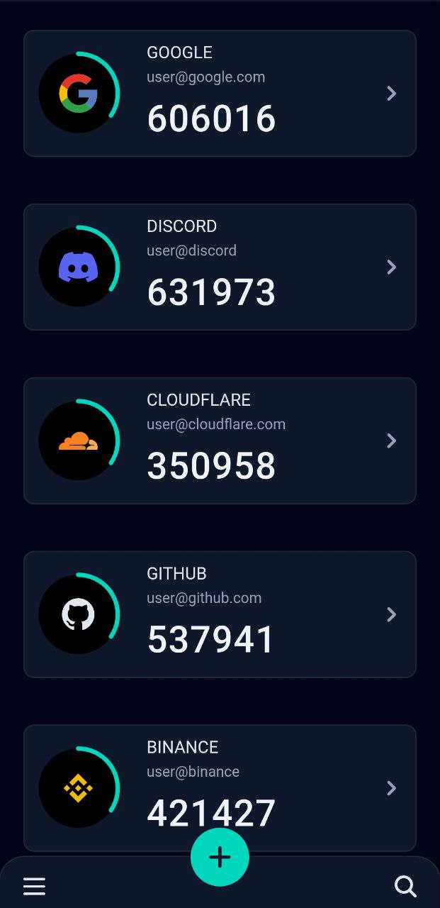
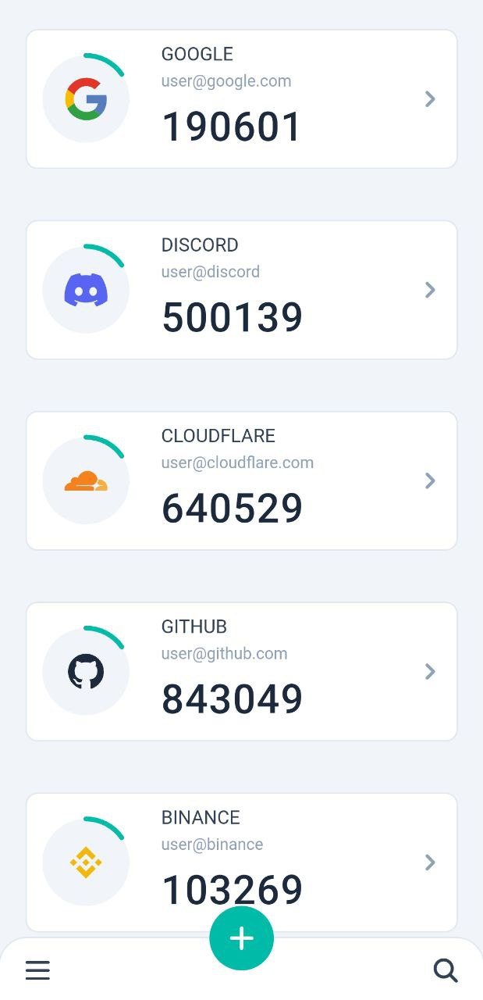
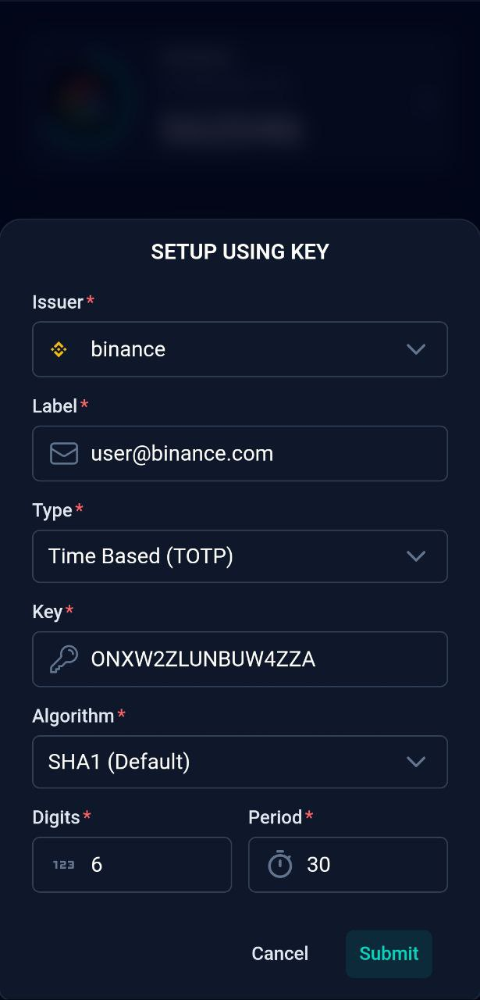
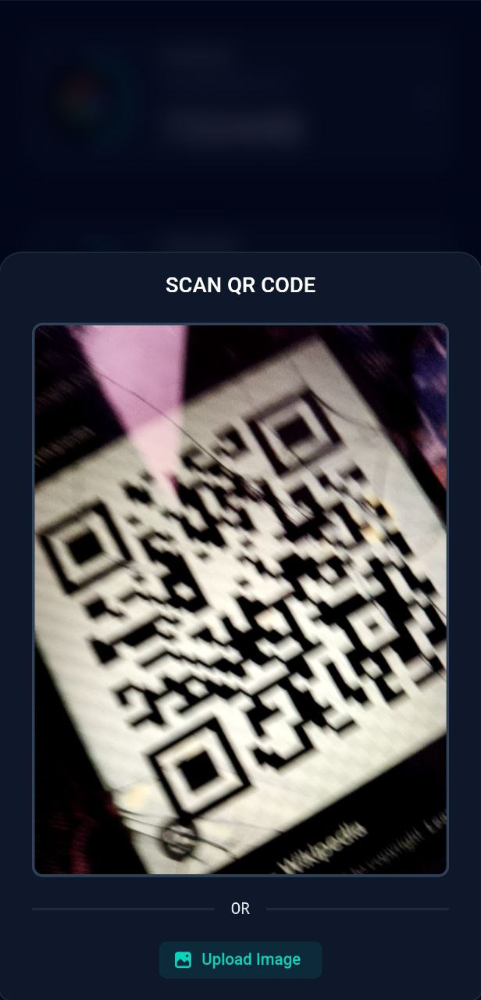
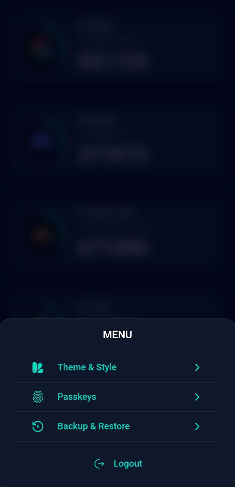
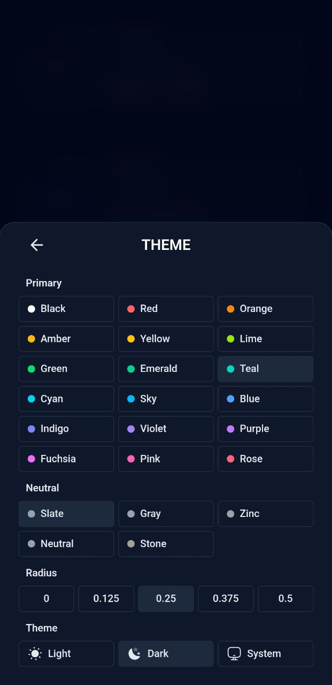

<div align="center">

</div>
<h1 align="center">MyAuthenticator</h1>
<p align="center">A serverless progressive web application that generates TOTP and HOTP codes, offering robust two-factor authentication (2FA) directly within your browser.</p>

<div align="center">
  
[](https://nuxt.com)
[](https://hub.nuxt.com)
[](https://ui.nuxt.com)
[](https://pages.cloudflare.com)
[](https://www.typescriptlang.org)
[](https://drizzle.com)
[](https://tailwindcss.com)

</div>

## Live Demo

[](https://my-authenticator.pages.dev)

- Credentials: `admin` - `Admin@123$`

## Deploy 🚀

[](https://hub.nuxt.com/new?repo=IAMSDR/MyAuthenticator)

> [!NOTE]
> This project is currently under testing and improvements. Please back up your data before proceeding.

You can deploy this project on your Cloudflare account for **free** with zero configuration using **[NuxtHub](https://hub.nuxt.com)**. You can use either the NuxtHub CLI or the NuxtHub Admin Web UI. Simply select your GitHub account, set the required environment variables, and you're done. You now have your own authenticator.

## Features 🔥

**🚀 Serverless:** Fully leverages edge support, eliminating the need for server maintenance. Deploy on Cloudflare Pages for _free_.

**⚙️ Compatibility:** Supports `TOTP` (Time-Based One-Time Password) and `HOTP` (HMAC-Based One-Time Password), widely used for two-factor authentication.

**☀️ Theming:** Built with Nuxt UI v3, offering light and dark themes with customizable accent colors and more.

**💫 Icons:** Fetches icons directly from [Iconify](https://iconify.design/), providing a vast collection from various icon sets.

**🔐 Secure:** Utilizes `nuxt-auth-utils` for authentication, supports passkeys for secure access, and encrypts database fields for enhanced security.

**🗃️ Backup / Restore:** Securely backup and restore authenticators with encryption seamlessly.

## Screenshots 📱

<p>
  
  
  
  
  
  
</p>

## Environment Variables

```sh
# required
NUXT_SESSION_PASSWORD="your-32-char-super-long-secret-for-session-encryption"
NUXT_AUTH_USERNAME="admin"
NUXT_AUTH_PASSWORD="Admin@123$"

# optional
NUXT_DB_ENCRYPTION_PASSWORD="your-32-char-super-long-secret-for-db-encryption"
```

### Required Variables

- `NUXT_SESSION_PASSWORD`: This password is used by `nuxt-auth-utils` to secure your session. It must be at least 32 characters long.

- `NUXT_AUTH_USERNAME`: The username for authentication. It must be at least 5 characters long.

- `NUXT_AUTH_PASSWORD`: The password for authentication. It must be at least 8 characters long and include:
  - One uppercase letter
  - One digit
  - One lowercase letter
  - Two special characters

### Optional Variables

- `NUXT_DB_ENCRYPTION_PASSWORD`: This password is used to encrypt and decrypt the database field of `secretkey`. By default, no encryption is used for data stored in the database. You can enable encryption by setting this variable. `It must be exactly 32 characters long`.

## Contributing and Suggestions

Feel free to contribute to this project with your ideas and improvements. Your feedback and suggestions are highly valued and will help enhance this project further.

## License

MyAuthenticator is Free Software: You can use, study, share, and improve it at your will. Specifically, you can redistribute and/or modify it under the terms of the [GNU Affero General Public License](https://www.gnu.org/licenses/agpl-3.0.en.html) as published by the Free Software Foundation, either version 3 of the License, or (at your option) any later version.
